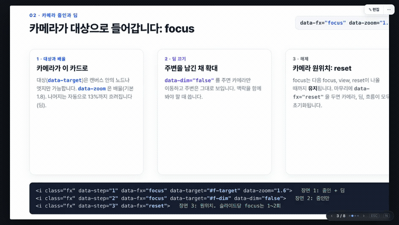
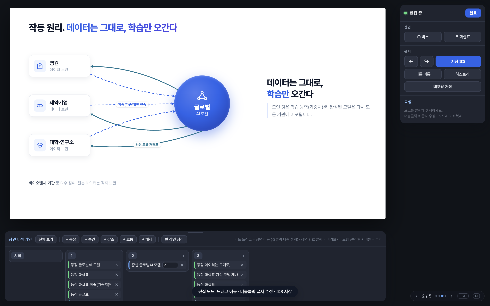
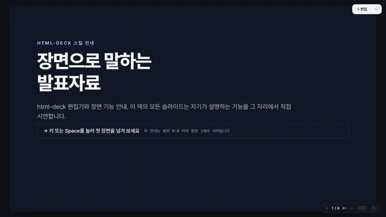
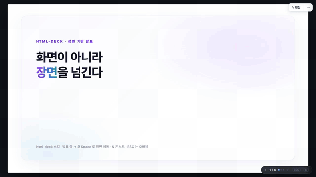
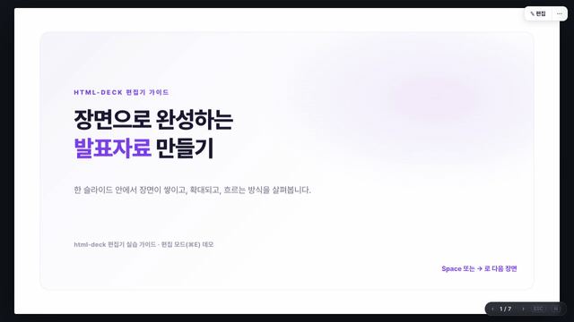
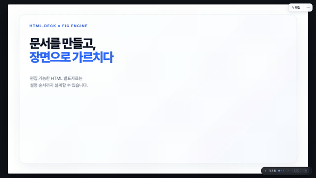
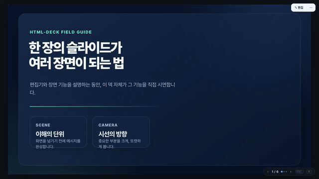
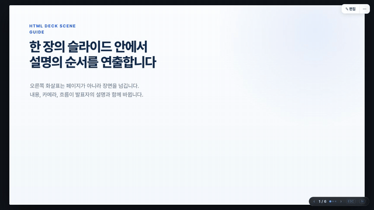
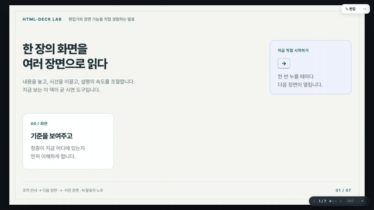

# html-deck

장면(step) 기반 HTML 발표자료를 만드는 Claude Code 스킬입니다. **→ 키가 페이지가 아니라 장면을 넘깁니다.** 한 슬라이드 안에서 요소가 단계적으로 나타나고, 특정 부분으로 카메라가 줌인되며(나머지는 흐려짐), 화살표에 흐름이 재생되고, 장면이 소진되면 다음 슬라이드로 넘어갑니다. 산출물은 외부 의존이 없는 HTML 한 파일이고, [html-diagram](https://github.com/tonywjs/html-diagram)의 편집 엔진이 내장돼 있어 편집 모드(⌘E)에서 도형·글자를 고치고 같은 파일에 저장(⌘S)할 수 있습니다.

<p></p>

<sub>실제 발표 화면을 그대로 녹화한 것입니다(8슬라이드 전체, 2배속). 카드가 장면마다 하나씩 쌓이고, 카메라가 한 카드로 줌인해 나머지를 흐리게 만들고, 화살표에 흐름이 재생됩니다. 정지 화면으로는 담기지 않는 부분이라 움직이는 그림으로 뒀습니다. 원본 속도는 <a href="https://github.com/tonywjs/html-deck/releases/tag/v1.0.0">릴리스 v1.0.0</a>의 mp4에 있습니다.</sub>

## 무엇을 해 주나

- **장면 진행**: `data-step="n"`(장면 n부터) / `"n-m"`(n~m에만)으로 노드·화살표·노드 안 요소를 단계 공개. →/Space/PageDown 다음, ←/PageUp 이전, 역방향에서도 카메라·흐름 상태가 그대로 복원됩니다.
- **연출 지시자 `.fx`**: `focus`(대상으로 줌 + 나머지 딤), `view`(영역이 슬라이드를 채우도록 카메라 이동. 슬라이드보다 넓은 여정형 캔버스용), `flow`(화살표 흐름), `pulse`(1회 강조), `reset`.
- **슬라이드 전환 안무**: 프레임은 고정된 채 내용 요소가 읽기 순서로 캐스케이드 진입(`rise` 기본, `flow`·`fade`·`zoom-in`·`zoom-out`·`none`). `prefers-reduced-motion`이면 생략.
- **편집 모드 + 장면 타임라인**: ⌘E로 모든 장면을 펼치고 카메라를 풀어 도형을 편집하며, 하단 타임라인에서 등장·줌인·강조·흐름·해제를 추가·이동·삭제하고 장면 번호를 눌러 미리봅니다. 저장 파일에는 런타임 상태가 남지 않습니다.
- **발표 도구**: HUD(페이지·장면 점), ESC 오버뷰, N 발표자 노트, 숫자+Enter 점프, URL 해시(`#2.1`) 공유, 인쇄(⌘P)는 슬라이드당 한 장.

<p></p>

## 설치

이 스킬은 **html-diagram 스킬을 전제**로 합니다(도식 규약과 편집 엔진). 두 폴더를 나란히 두세요.

**Claude Code**

```bash
git clone https://github.com/tonywjs/html-diagram.git ~/.claude/skills/html-diagram
git clone https://github.com/tonywjs/html-deck.git ~/.claude/skills/html-deck
```

Claude Code는 `SKILL.md`의 description을 보고 발표자료·슬라이드 요청에 이 스킬을 자동으로 씁니다. `/html-deck`으로 직접 부를 수도 있습니다.

**Codex CLI** (`~/.agents/skills/`를 읽습니다)

```bash
git clone https://github.com/tonywjs/html-diagram.git ~/.agents/skills/html-diagram
git clone https://github.com/tonywjs/html-deck.git ~/.agents/skills/html-deck
```

Claude Code 쪽에 이미 받았다면 심볼릭 링크로 충분합니다.

```bash
ln -s ~/.claude/skills/html-diagram ~/.agents/skills/html-diagram
ln -s ~/.claude/skills/html-deck ~/.agents/skills/html-deck
```

조립 스크립트는 엔진을 `HTML_DIAGRAM_DIR` → 형제 폴더 → `~/.claude/skills` → `~/.agents/skills` 순으로 찾고, 어디에도 없으면 `assets/template.html`에 인라인된 엔진을 씁니다. html-diagram이 없어도 덱은 만들어지지만 엔진 갱신은 되지 않습니다.

**그 밖의 에이전트**: SKILL.md와 assets로 이루어진 [Agent Skills](https://agentskills.io) 규격이라, 같은 규격을 읽는 도구라면 폴더를 그대로 두면 됩니다.

## 구조

| 경로 | 역할 |
|---|---|
| `SKILL.md` | 에이전트용 규약, 생성 워크플로, 장면·애니메이션 원칙, 타이포그래피 기준, 품질 스니펫, 체크리스트 |
| `assets/deck-runtime.js`, `assets/deck-runtime.css` | 장면 런타임(문서에 인라인됨). 장면·카메라·전환·HUD·오버뷰·노트·타임라인 |
| `assets/template-skeleton.html` | 소스 파일의 출발점. `<title>`, 첫 `<style>`, 슬라이드들만 작성 |
| `assets/build-template.py` | 소스의 플레이스홀더 4개에 엔진과 런타임을 인라인해 조립. 인자 없이 실행하면 템플릿과 예시를 재생성 |
| `assets/template.html` | 조립된 빈 덱(엔진 인라인 폴백의 원천) |
| `assets/static-check.py` | 브라우저 없는 환경용 정적 검사(title·줄표·id·fx 대상·장면 번호 연속성·엔진 무결) |
| `assets/tests/` | 런타임 회귀 테스트(`run.sh`, Aside 브라우저 CLI 필요) |
| `examples/` | `demo-deck`(원리·장점·과제·여정형 캔버스), `green-test-roadmap`(사업 추진 보고). `*-src.html`이 원본, `.html`이 조립본 |
| `docs/` | README 스크린샷 |
| `compare/` | 같은 브리프로 일곱 모델이 만든 덱 비교 |

## 문서 규약 요약

```html
<div class="deck" data-slide-size="1280x720">
  <section class="slide" data-title="작동 원리" data-transition="flow">
    <div class="fig-canvas" data-size="1280x720">
      <div class="fig-node" id="hub" style="left:560px;top:240px;width:190px" data-step="1">…</div>
      <div class="fig-edge" id="e1" data-from="pharma" data-to="hub" data-step="1"></div>
      <i class="fx" data-step="1" data-fx="flow"  data-target="#e1"></i>
      <i class="fx" data-step="2" data-fx="focus" data-target="#hub" data-zoom="2"></i>
      <i class="fx" data-step="3" data-fx="reset"></i>
    </div>
    <aside class="notes">발표자 노트 (N 키로 표시)</aside>
  </section>
</div>
```

슬라이드 안은 html-diagram의 규약(`.fig-canvas` / `.fig-node` / `.fig-edge`) 그대로이고, 여기에 `data-step`과 `.fx` 지시자가 더해집니다. 자세한 규칙과 품질 기준은 [SKILL.md](SKILL.md)에 있습니다.

## 검증

산출물마다 `assets/static-check.py`가 `pass:true`, 브라우저에서 콘솔 오류 0, SKILL.md의 품질 스니펫이 전 슬라이드 `pass:true`, → 로 끝까지 진행하고 ← 로 되돌아올 때 카메라·흐름이 복원되는지를 확인합니다. 런타임이나 엔진을 고쳤을 때는 `python3 assets/build-template.py`로 템플릿과 예시를 재생성하고 `bash assets/tests/run.sh`로 회귀 테스트를 돌립니다.

## 모델 비교

<!-- RESULTS:START -->
같은 브리프로 일곱 모델이 만든 편집기 사용법 덱을 같은 하네스로 검사한 결과입니다. 브라우저 판정(품질 스니펫, 콘솔, 장면 진행)은 전부 하네스가 수행했습니다. 조건, 커버리지, 전체 스크린샷은 [compare/README.md](compare/README.md)에 있습니다.

| 모델 | 생각 강도 | 슬라이드 | 장면(최대) | 노드 | 엣지 | 채움 비율(%) | 최소 글자(px) | 엔진 무결 | 규약 | 문장부호 | 품질 스니펫 | 콘솔 0건 | 장면 진행 |
|---|---|---|---|---|---|---|---|---|---|---|---|---|---|
| Claude Fable 5.1 (기준) | 기본 (세션 상속) | 8 | 3 | 62 | 10 | 63 / 81 / 81 / 81 / 82 / 81 / 81 / 81 | 14 / 14 / 14 / 14 / 15.1 / 14 / 14 / 14 | O | O | O | O | O | O |
| Claude Opus 5 | 기본 (세션 상속) | 6 | 4 | 52 | 7 | 79 / 76 / 74 / 78 / 76 / 76 | 15 / 14 / 15 / 14 / 14 / 15.1 | O | O | O | O | O | O |
| Claude Sonnet 5 | 기본 (세션 상속) | 7 | 5 | 59 | 9 | 77 / 78 / 77 / 75 / 74 / 84 / 77 | 15 / 15 / 16 / 15 / 18 / 14.5 / 11 | O | O | O | X | O | O |
| GPT-5.6 luna | xhigh (Codex 기본값) | 6 | 3 | 63 | 12 | 82 / 82 / 82 / 82 / 83 / 90 | 14 / 14 / 14 / 14 / 14 / 14.5 | O | O | O | O | O | O |
| GPT-5.6 terra | xhigh (Codex 기본값) | 6 | 4 | 52 | 12 | 83 / 83 / 83 / 83 / 85 / 83 | 15 / 15 / 15 / 15 / 15.1 / 16 | O | O | O | O | O | O |
| GPT-5.6 sol | xhigh (Codex 기본값) | 6 | 3 | 39 | 6 | 73 / 79 / 79 / 78 / 82 / 78 | 14 / 14 / 14 / 14 / 14.5 / 14 | O | O | O | O | O | O |
| GPT-5.6 astra | xhigh (Codex 기본값) | 7 | 3 | 50 | 9 | 82 / 82 / 82 / 82 / 83 / 82 / 82 | 14 / 14 / 14 / 14 / 15.1 / 14 / 14 | O | O | O | O | O | O |

O 통과 · X 실패 · 채움 비율과 최소 글자는 슬라이드별 값.

- **Claude Fable 5.1 (기준)**: 8슬라이드로 가장 길고 발표자료보다 참고서에 가깝다. 단계 공개 슬라이드는 장면 0부터 3까지를 가로 타임라인으로 깔고 각 data-step 값이 실제로 어떻게 보이는지 카드로 붙였다. 전환 슬라이드는 다섯 프리셋을 각각 미니 도식으로 보여 주어 일곱 중 전환 설명이 가장 완전하다. 마지막 슬라이드에 fx 용어집과 산출 전 체크리스트를 붙여 덱이 레퍼런스 역할까지 한다. 타이틀 슬라이드 채움이 63%로 낮지만 SKILL.md가 간지 슬라이드를 예외로 둔 범위 안이다.
- **Claude Opus 5**: 흰 바탕에 보라 강조를 쓴 절제된 구성. 단계 공개 슬라이드가 특히 좋다. 왼쪽 어두운 패널에 data-step 속성 표기를 나열하고 오른쪽에서 그 값들이 실제로 하나씩 쌓이며, 범위(2-3) 요소는 나타났다가 장면 4에서 사라지는 것까지 화면에서 보여 준다. 줌인 슬라이드는 카드 안에 .deck-focus로만 드러나는 설명을 숨겨 두어, 확대했을 때 비로소 채워지는 문서의 고급 패턴을 썼다.
- **Claude Sonnet 5**: 보라 강조의 밝은 구성. 강조(pulse) 슬라이드를 아예 발표 전 점검 목록으로 만들어 기능 시연과 실무 점검을 겹쳐 놓은 발상이 좋다. 다만 마지막 편집 모드 슬라이드에서 실제 장면 타임라인 UI를 그 크기 그대로 옮기다 보니 글자가 11px까지 내려가 덱 하한 14px을 어겼다. 브라우저를 보지 못한 채 설계한 조건에서 드러난 유일한 실패다. 한편 이 모델은 정적 검사기가 본문에 설명으로 적힌 data-step 표기까지 속성으로 오인하는 오탐을 찾아내 우회했고, 그 지적을 받아 스킬의 검사기를 고쳤다.
- **GPT-5.6 luna**: 남색과 파랑의 카드 격자로 정돈돼 있다. 단계 공개 슬라이드에서 단일 번호와 범위(2-3)를 카드 세 장으로 나란히 놓고 속성 표기를 어두운 띠에 담아, 시연과 설명이 한 화면에서 붙는다. 마지막 여정 캔버스는 시작·전체·팬 세 구간을 한 줄로 이어 카메라 이동을 이해시킨다.
- **GPT-5.6 terra**: 짙은 남색과 청록의 어두운 테마로 일곱 중 개성이 가장 뚜렷하다. 장면마다 번호 배지를 달고 타임라인을 실제 트랙 그림으로 그렸다. 다만 두 번째 슬라이드에서 두 줄로 늘어난 제목이 바로 아래 본문 문단과 겹쳐 글자가 포개진다. 어두운 테마인데 슬라이드 바탕은 흰색이라 캔버스가 덮지 못한 아래쪽이 흰 띠로 보인다.
- **GPT-5.6 sol**: 밝은 회백 바탕에 파랑과 주황 강조선을 쓴 안정적인 구성. 슬라이드마다 우상단에 시연 중인 속성 이름을 배지로 달아 무엇을 보여 주는 중인지 분명하다. focus 슬라이드의 카드 본문 글자가 매우 옅은 회색이라 크기는 기준을 넘지만 투사 환경에서는 대비가 부족해 보인다.
- **GPT-5.6 astra**: GPT 넷 중 가장 길고(7슬라이드), 크림색 실험노트 톤을 끝까지 유지한다. 슬라이드마다 머리글 번호와 하단 요약 줄을 두어 흐름이 또렷하다. focus 카드 안에 실제 속성 표기를 적어 두어 시연과 설명이 한 덩어리로 읽힌다.

채움 비율은 모든 장면을 펼친 상태에서 노드 bounding box가 슬라이드를 덮는 넓이라, 전면 배경판 노드 하나로도 100%가 된다. 채움 100%는 밀도가 아니라 배경판 사용을 뜻할 수 있다. 최소 글자는 넓은 여정형 캔버스의 축소율을 곱한 실측값이다. 영상은 덱을 처음부터 끝까지 실제로 넘기며 녹화한 것이고, 문서에 실린 움직이는 그림은 그 영상을 2.5배속으로 줄인 것이다. 원래 속도로 보려면 그림을 눌러 mp4를 연다.

<table><tr><td align="center"><a href="compare/videos/fable51.gif"></a><br><sub><b>Claude Fable 5.1 (기준)</b><br><a href="compare/videos/fable51.gif">큰 화면</a> · <a href="https://github.com/tonywjs/html-deck/releases/download/v1.0.0/fable51.mp4">mp4</a> · <a href="compare/fable51/deck.html">deck.html</a></sub></td><td align="center"><a href="compare/videos/opus5.gif"></a><br><sub><b>Claude Opus 5</b><br><a href="compare/videos/opus5.gif">큰 화면</a> · <a href="https://github.com/tonywjs/html-deck/releases/download/v1.0.0/opus5.mp4">mp4</a> · <a href="compare/opus5/deck.html">deck.html</a></sub></td></tr><tr><td align="center"><a href="compare/videos/sonnet5.gif"></a><br><sub><b>Claude Sonnet 5</b><br><a href="compare/videos/sonnet5.gif">큰 화면</a> · <a href="https://github.com/tonywjs/html-deck/releases/download/v1.0.0/sonnet5.mp4">mp4</a> · <a href="compare/sonnet5/deck.html">deck.html</a></sub></td><td align="center"><a href="compare/videos/gpt56-luna.gif"></a><br><sub><b>GPT-5.6 luna</b><br><a href="compare/videos/gpt56-luna.gif">큰 화면</a> · <a href="https://github.com/tonywjs/html-deck/releases/download/v1.0.0/gpt56-luna.mp4">mp4</a> · <a href="compare/gpt56-luna/deck.html">deck.html</a></sub></td></tr><tr><td align="center"><a href="compare/videos/gpt56-terra.gif"></a><br><sub><b>GPT-5.6 terra</b><br><a href="compare/videos/gpt56-terra.gif">큰 화면</a> · <a href="https://github.com/tonywjs/html-deck/releases/download/v1.0.0/gpt56-terra.mp4">mp4</a> · <a href="compare/gpt56-terra/deck.html">deck.html</a></sub></td><td align="center"><a href="compare/videos/gpt56-sol.gif"></a><br><sub><b>GPT-5.6 sol</b><br><a href="compare/videos/gpt56-sol.gif">큰 화면</a> · <a href="https://github.com/tonywjs/html-deck/releases/download/v1.0.0/gpt56-sol.mp4">mp4</a> · <a href="compare/gpt56-sol/deck.html">deck.html</a></sub></td></tr><tr><td align="center"><a href="compare/videos/gpt56-astra.gif"></a><br><sub><b>GPT-5.6 astra</b><br><a href="compare/videos/gpt56-astra.gif">큰 화면</a> · <a href="https://github.com/tonywjs/html-deck/releases/download/v1.0.0/gpt56-astra.mp4">mp4</a> · <a href="compare/gpt56-astra/deck.html">deck.html</a></sub></td></tr></table>
<!-- RESULTS:END -->

## 라이선스

MIT입니다. [LICENSE](LICENSE)를 보세요. 출처 표기와 라이선스 문구만 남기면 개인·상업 용도 모두 자유롭게 쓰고 고치고 재배포할 수 있습니다. 내장되는 편집 엔진(html-diagram)도 MIT입니다.
