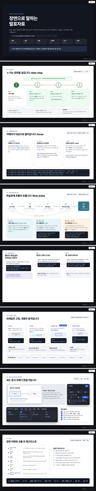
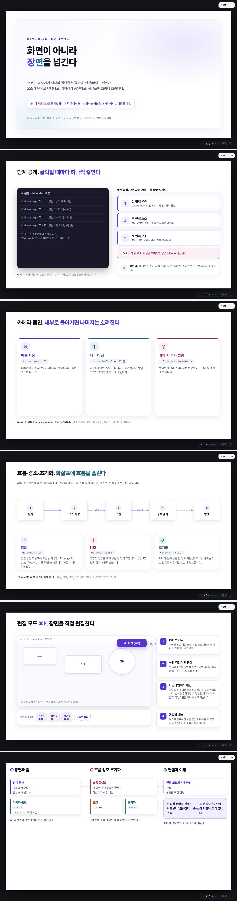
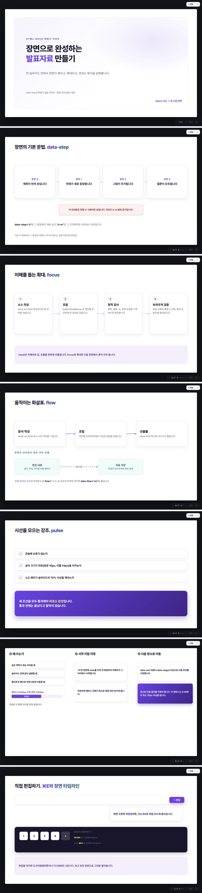
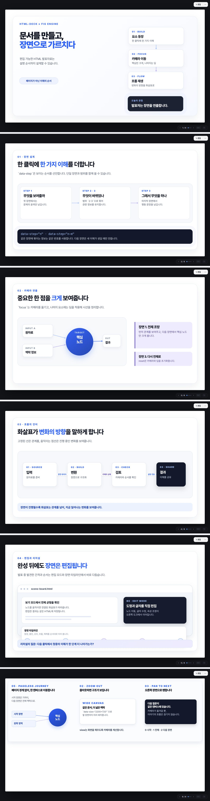
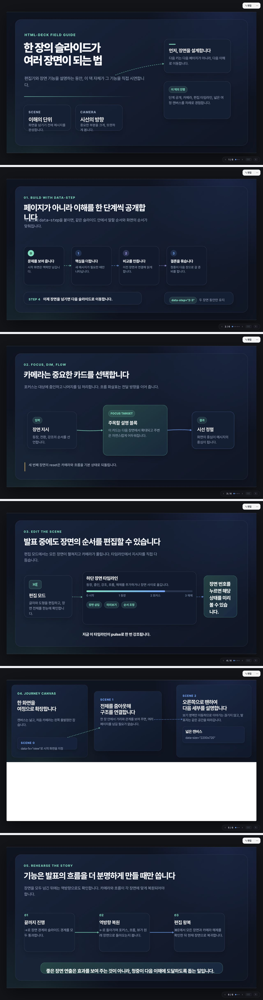
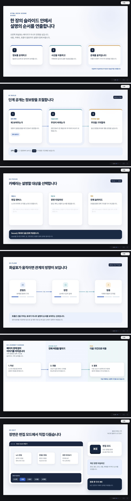
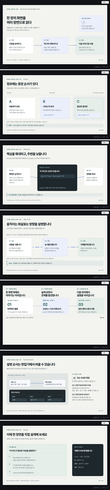

# 모델 비교: 편집기 사용법 덱

같은 브리프로 일곱 모델에게 html-deck 스킬을 쓰게 하고, 산출물을 같은 하네스로 검사했습니다. 표의 브라우저 판정(품질 스니펫, 콘솔, 장면 진행)은 모델이 아니라 하네스가 전부 수행했습니다. `index.html`은 같은 내용에 스크린샷을 내장한 한 파일 판인데 GitHub 미리보기 한도를 넘으므로 내려받아 열어야 합니다. 이 문서가 같은 결과를 담고 있습니다.

## 브리프

- 주제: html-deck 편집기와 장면 기능을 가르치는 덱. 각 슬라이드가 설명하는 기능을 실제로 쓰면서 스스로를 시연. 단계공개(data-step, 범위 포함), 줌인 focus, 흐름 flow, 여정형 캔버스(view), 전환 프리셋, pulse, reset, 발표자 노트, 편집 모드·타임라인 안내를 모두 포함. 최소 5슬라이드, 1280x720, 한국어, 이모지·줄표 금지.
- 오염 방지: 주제가 다른 기존 예시(`examples/*-src.html`)는 형식 참고만 하고 베끼지 않도록 지시.
- 브리프 원문은 [PROMPT.txt](PROMPT.txt). 일곱 모델 모두 같은 원문을 받았고, Claude 서브에이전트에만 "브라우저 도구 사용 금지(공유 브라우저 충돌 방지), 정적 검사만" 한 줄이 추가됐습니다. 결과 판정은 모델이 아니라 중앙 하네스가 일곱 모두에게 똑같이 수행했습니다.

## 조건

| 모델 | 실행 경로 | 생각 강도 | 모델 자신의 검증 |
|---|---|---|---|
| Claude Fable 5.1 (기준) | Claude Code 서브에이전트 (기준본) | 기본 (세션 상속) | 정적 검사만 (브라우저 금지) |
| Claude Opus 5 | Claude Code 서브에이전트 | 기본 (세션 상속) | 정적 검사만 (브라우저 금지) |
| Claude Sonnet 5 | Claude Code 서브에이전트 | 기본 (세션 상속) | 정적 검사만 (브라우저 금지) |
| GPT-5.6 luna | Codex CLI codex exec | xhigh (Codex 기본값) | 정적 검사 + 자체 브라우저 검증 |
| GPT-5.6 terra | Codex CLI codex exec | xhigh (Codex 기본값) | 정적 검사 + 자체 브라우저 검증 |
| GPT-5.6 sol | Codex CLI codex exec | xhigh (Codex 기본값) | 정적 검사 + 자체 브라우저 검증 |
| GPT-5.6 astra | Codex CLI codex exec | xhigh (Codex 기본값) | 정적 검사 + 자체 브라우저 검증 |

Claude 세 모델은 Claude Code 서브에이전트로 모델을 지정해 실행했고, GPT 네 모델은 Codex CLI(`codex exec`)로 실행했습니다. 생각 강도를 따로 지정하지 않아 기본값이 적용됐으므로 조건이 완전히 같지는 않습니다.

조건이 한 가지 어긋났습니다. Claude 세 모델은 공유 브라우저 충돌을 막으려고 "브라우저 도구 사용 금지, 정적 검사만" 지시를 받아 자기 덱이 렌더되는 모습을 한 번도 보지 못한 채 설계했습니다. GPT 네 모델은 Codex의 셸 권한으로 각자 로컬 서버를 띄우고 스스로 브라우저 검증을 하며 고쳤습니다. 표의 판정은 일곱 모두 같은 중앙 하네스가 수행했으므로 결과 비교는 공정하지만, 가는 길은 Claude 쪽이 불리했습니다.

## 결과

| 모델 | 생각 강도 | 슬라이드 | 장면(최대) | 노드 | 엣지 | 채움 비율(%) | 최소 글자(px) | 엔진 무결 | 규약 | 문장부호 | 품질 스니펫 | 콘솔 0건 | 장면 진행 |
|---|---|---|---|---|---|---|---|---|---|---|---|---|---|
| Claude Fable 5.1 (기준) | 기본 (세션 상속) | 8 | 3 | 62 | 10 | 63 / 81 / 81 / 81 / 82 / 81 / 81 / 81 | 14 / 14 / 14 / 14 / 15.1 / 14 / 14 / 14 | O | O | O | O | O | O |
| Claude Opus 5 | 기본 (세션 상속) | 6 | 4 | 52 | 7 | 79 / 76 / 74 / 78 / 76 / 76 | 15 / 14 / 15 / 14 / 14 / 15.1 | O | O | O | O | O | O |
| Claude Sonnet 5 | 기본 (세션 상속) | 7 | 5 | 59 | 9 | 77 / 78 / 77 / 75 / 74 / 84 / 77 | 15 / 15 / 16 / 15 / 18 / 14.5 / 11 | O | O | O | X | O | O |
| GPT-5.6 luna | xhigh (Codex 기본값) | 6 | 3 | 63 | 12 | 82 / 82 / 82 / 82 / 83 / 90 | 14 / 14 / 14 / 14 / 14 / 14.5 | O | O | O | O | O | O |
| GPT-5.6 terra | xhigh (Codex 기본값) | 6 | 4 | 52 | 12 | 83 / 83 / 83 / 83 / 85 / 83 | 15 / 15 / 15 / 15 / 15.1 / 16 | O | O | O | O | O | O |
| GPT-5.6 sol | xhigh (Codex 기본값) | 6 | 3 | 39 | 6 | 73 / 79 / 79 / 78 / 82 / 78 | 14 / 14 / 14 / 14 / 14.5 / 14 | O | O | O | O | O | O |
| GPT-5.6 astra | xhigh (Codex 기본값) | 7 | 3 | 50 | 9 | 82 / 82 / 82 / 82 / 83 / 82 / 82 | 14 / 14 / 14 / 14 / 15.1 / 14 / 14 | O | O | O | O | O | O |

O 통과 · X 실패 · 채움 비율과 최소 글자는 슬라이드별 값. 장면 진행은 → 로 끝까지 도달하고 ← 로 처음까지 복원되는지.

판정 두 가지를 SKILL.md 기준에 맞춰 조정했다. 채움 70%는 콘텐츠 슬라이드에만 적용하고 타이틀 슬라이드는 예외로 뒀다(문서가 그렇게 정하고 있고, 55% 미만이면 재고 대상). 그리고 편집 버튼 라벨을 그대로 인용한 ✎ 같은 UI 글자는 장식 이모지로 세지 않았다. Fable과 Sonnet 두 덱이 편집 모드를 설명하며 이 글자를 썼는데, 편집기 화면에 실제로 찍혀 있는 글자다.

## 커버리지 (정적 분석)

| 모델 | 단계공개 | 범위 n-m | 줌인 focus | 흐름 flow | 여정 view | 강조 pulse | 초기화 reset | 여정 캔버스 | 전환 프리셋 수 | 노트(전 슬라이드) |
|---|---|---|---|---|---|---|---|---|---|---|
| Claude Fable 5.1 (기준) | O | O | O | O | O | O | O | O | 5 | O |
| Claude Opus 5 | O | O | O | O | O | O | O | O | 4 | O |
| Claude Sonnet 5 | O | O | O | O | O | O | O | O | 4 | O |
| GPT-5.6 luna | O | O | O | O | O | O | O | O | 4 | O |
| GPT-5.6 terra | O | O | O | O | O | O | O | O | 4 | O |
| GPT-5.6 sol | O | O | O | O | O | O | O | O | 4 | O |
| GPT-5.6 astra | O | O | O | O | O | O | O | O | 4 | O |

브리프가 요구한 장면 기능을 실제로 썼는지. 전환 프리셋 수는 `none`을 제외한 서로 다른 `data-transition` 값의 수.

## 정성 메모

- **Claude Fable 5.1 (기준)**: 8슬라이드로 가장 길고 발표자료보다 참고서에 가깝다. 단계 공개 슬라이드는 장면 0부터 3까지를 가로 타임라인으로 깔고 각 data-step 값이 실제로 어떻게 보이는지 카드로 붙였다. 전환 슬라이드는 다섯 프리셋을 각각 미니 도식으로 보여 주어 일곱 중 전환 설명이 가장 완전하다. 마지막 슬라이드에 fx 용어집과 산출 전 체크리스트를 붙여 덱이 레퍼런스 역할까지 한다. 타이틀 슬라이드 채움이 63%로 낮지만 SKILL.md가 간지 슬라이드를 예외로 둔 범위 안이다.
- **Claude Opus 5**: 흰 바탕에 보라 강조를 쓴 절제된 구성. 단계 공개 슬라이드가 특히 좋다. 왼쪽 어두운 패널에 data-step 속성 표기를 나열하고 오른쪽에서 그 값들이 실제로 하나씩 쌓이며, 범위(2-3) 요소는 나타났다가 장면 4에서 사라지는 것까지 화면에서 보여 준다. 줌인 슬라이드는 카드 안에 .deck-focus로만 드러나는 설명을 숨겨 두어, 확대했을 때 비로소 채워지는 문서의 고급 패턴을 썼다.
- **Claude Sonnet 5**: 보라 강조의 밝은 구성. 강조(pulse) 슬라이드를 아예 발표 전 점검 목록으로 만들어 기능 시연과 실무 점검을 겹쳐 놓은 발상이 좋다. 다만 마지막 편집 모드 슬라이드에서 실제 장면 타임라인 UI를 그 크기 그대로 옮기다 보니 글자가 11px까지 내려가 덱 하한 14px을 어겼다. 브라우저를 보지 못한 채 설계한 조건에서 드러난 유일한 실패다. 한편 이 모델은 정적 검사기가 본문에 설명으로 적힌 data-step 표기까지 속성으로 오인하는 오탐을 찾아내 우회했고, 그 지적을 받아 스킬의 검사기를 고쳤다.
- **GPT-5.6 luna**: 남색과 파랑의 카드 격자로 정돈돼 있다. 단계 공개 슬라이드에서 단일 번호와 범위(2-3)를 카드 세 장으로 나란히 놓고 속성 표기를 어두운 띠에 담아, 시연과 설명이 한 화면에서 붙는다. 마지막 여정 캔버스는 시작·전체·팬 세 구간을 한 줄로 이어 카메라 이동을 이해시킨다.
- **GPT-5.6 terra**: 짙은 남색과 청록의 어두운 테마로 일곱 중 개성이 가장 뚜렷하다. 장면마다 번호 배지를 달고 타임라인을 실제 트랙 그림으로 그렸다. 다만 두 번째 슬라이드에서 두 줄로 늘어난 제목이 바로 아래 본문 문단과 겹쳐 글자가 포개진다. 어두운 테마인데 슬라이드 바탕은 흰색이라 캔버스가 덮지 못한 아래쪽이 흰 띠로 보인다.
- **GPT-5.6 sol**: 밝은 회백 바탕에 파랑과 주황 강조선을 쓴 안정적인 구성. 슬라이드마다 우상단에 시연 중인 속성 이름을 배지로 달아 무엇을 보여 주는 중인지 분명하다. focus 슬라이드의 카드 본문 글자가 매우 옅은 회색이라 크기는 기준을 넘지만 투사 환경에서는 대비가 부족해 보인다.
- **GPT-5.6 astra**: GPT 넷 중 가장 길고(7슬라이드), 크림색 실험노트 톤을 끝까지 유지한다. 슬라이드마다 머리글 번호와 하단 요약 줄을 두어 흐름이 또렷하다. focus 카드 안에 실제 속성 표기를 적어 두어 시연과 설명이 한 덩어리로 읽힌다.

채움 비율은 모든 장면을 펼친 상태에서 노드 bounding box가 슬라이드를 덮는 넓이라, 전면 배경판 노드 하나로도 100%가 된다. 채움 100%는 밀도가 아니라 배경판 사용을 뜻할 수 있다. 최소 글자는 넓은 여정형 캔버스의 축소율을 곱한 실측값이다. 스크린샷은 슬라이드 내용을 다 보이려고 모든 장면을 펼치고 카메라를 푼 상태로 찍었다. 그래서 여정형 캔버스 슬라이드는 캔버스가 덮지 못한 아래쪽이 비어 보이는데, 실제 발표에서는 view 카메라가 그 영역을 채운다. 같은 이유로 확대했을 때만 나타나도록 .deck-focus에 걸어 둔 설명은 이 스크린샷에 보이지 않아 카드 아래가 비어 보일 수 있다.

## 하네스

1. `compare-static.py`: 엔진·런타임 블록 무결성, 규약(id·좌표·화살표 참조·fx 대상·장면 연속·제목·노트), 줄표·이모지, 기능 커버리지 → `static.json`
2. `run-verify.py [폴더…]`: Aside 브라우저 repl로 품질 스니펫, 장면 진행/역방향 복원, 슬라이드별 스크린샷 → `verify.json`, `shots/`
3. 콘솔 오류: 내장 Browser 패널의 `read_console_messages`로 확인해 `console.json`에 기록
4. `compare-report.py`: 위 결과와 스크린샷을 합쳐 `index.html` 생성. `gen-readme.py`: 같은 데이터로 이 문서와 루트 README의 결과 블록 생성

## 모델별 스크린샷

### Claude Fable 5.1 (기준)

[deck.html](fable51/deck.html) · [report.md](fable51/report.md)

8슬라이드로 가장 길고 발표자료보다 참고서에 가깝다. 단계 공개 슬라이드는 장면 0부터 3까지를 가로 타임라인으로 깔고 각 data-step 값이 실제로 어떻게 보이는지 카드로 붙였다. 전환 슬라이드는 다섯 프리셋을 각각 미니 도식으로 보여 주어 일곱 중 전환 설명이 가장 완전하다. 마지막 슬라이드에 fx 용어집과 산출 전 체크리스트를 붙여 덱이 레퍼런스 역할까지 한다. 타이틀 슬라이드 채움이 63%로 낮지만 SKILL.md가 간지 슬라이드를 예외로 둔 범위 안이다.

### Claude Opus 5

[deck.html](opus5/deck.html) · [report.md](opus5/report.md)

흰 바탕에 보라 강조를 쓴 절제된 구성. 단계 공개 슬라이드가 특히 좋다. 왼쪽 어두운 패널에 data-step 속성 표기를 나열하고 오른쪽에서 그 값들이 실제로 하나씩 쌓이며, 범위(2-3) 요소는 나타났다가 장면 4에서 사라지는 것까지 화면에서 보여 준다. 줌인 슬라이드는 카드 안에 .deck-focus로만 드러나는 설명을 숨겨 두어, 확대했을 때 비로소 채워지는 문서의 고급 패턴을 썼다.

### Claude Sonnet 5

[deck.html](sonnet5/deck.html) · [report.md](sonnet5/report.md)

보라 강조의 밝은 구성. 강조(pulse) 슬라이드를 아예 발표 전 점검 목록으로 만들어 기능 시연과 실무 점검을 겹쳐 놓은 발상이 좋다. 다만 마지막 편집 모드 슬라이드에서 실제 장면 타임라인 UI를 그 크기 그대로 옮기다 보니 글자가 11px까지 내려가 덱 하한 14px을 어겼다. 브라우저를 보지 못한 채 설계한 조건에서 드러난 유일한 실패다. 한편 이 모델은 정적 검사기가 본문에 설명으로 적힌 data-step 표기까지 속성으로 오인하는 오탐을 찾아내 우회했고, 그 지적을 받아 스킬의 검사기를 고쳤다.

### GPT-5.6 luna

[deck.html](gpt56-luna/deck.html) · [report.md](gpt56-luna/report.md)

남색과 파랑의 카드 격자로 정돈돼 있다. 단계 공개 슬라이드에서 단일 번호와 범위(2-3)를 카드 세 장으로 나란히 놓고 속성 표기를 어두운 띠에 담아, 시연과 설명이 한 화면에서 붙는다. 마지막 여정 캔버스는 시작·전체·팬 세 구간을 한 줄로 이어 카메라 이동을 이해시킨다.

### GPT-5.6 terra

[deck.html](gpt56-terra/deck.html) · [report.md](gpt56-terra/report.md)

짙은 남색과 청록의 어두운 테마로 일곱 중 개성이 가장 뚜렷하다. 장면마다 번호 배지를 달고 타임라인을 실제 트랙 그림으로 그렸다. 다만 두 번째 슬라이드에서 두 줄로 늘어난 제목이 바로 아래 본문 문단과 겹쳐 글자가 포개진다. 어두운 테마인데 슬라이드 바탕은 흰색이라 캔버스가 덮지 못한 아래쪽이 흰 띠로 보인다.

### GPT-5.6 sol

[deck.html](gpt56-sol/deck.html) · [report.md](gpt56-sol/report.md)

밝은 회백 바탕에 파랑과 주황 강조선을 쓴 안정적인 구성. 슬라이드마다 우상단에 시연 중인 속성 이름을 배지로 달아 무엇을 보여 주는 중인지 분명하다. focus 슬라이드의 카드 본문 글자가 매우 옅은 회색이라 크기는 기준을 넘지만 투사 환경에서는 대비가 부족해 보인다.

### GPT-5.6 astra

[deck.html](gpt56-astra/deck.html) · [report.md](gpt56-astra/report.md)

GPT 넷 중 가장 길고(7슬라이드), 크림색 실험노트 톤을 끝까지 유지한다. 슬라이드마다 머리글 번호와 하단 요약 줄을 두어 흐름이 또렷하다. focus 카드 안에 실제 속성 표기를 적어 두어 시연과 설명이 한 덩어리로 읽힌다.

